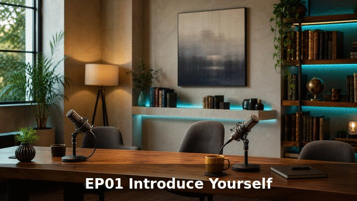

# YOUTYOB-LANGO

<<<<<<< HEAD
## شاهد الفيديو من هنا

**[▶ تشغيل الحلقة 01 على GitHub](https://dhiyaddineb-hue.github.io/YOUTYOB-LANGO/english-podcast-episode/episode-01/index.html?v=3)**

هذا الرابط تابع للمستودع. بعد كل فيديو جديد نحدّث `english-podcast-episode/latest.json` ثم نعمل push فيظهر على نفس الصفحة.

ملف الحلقة داخل المستودع: [`english-podcast-episode/episode-01/`](english-podcast-episode/episode-01/)

---

Workspace for professional English-learning YouTube videos. All production lives in **[english-podcast-episode/](english-podcast-episode/)**.
=======
## الفيديو داخل المستودع

صورة متحركة من الحلقة:

**الصوت الكامل للحلقة (ملف داخل المستودع):**  
[english-podcast-episode/output/episode-01.mp3](english-podcast-episode/output/episode-01.mp3)

**مشغّل الحلقة:**  
[english-podcast-episode/watch.html](english-podcast-episode/watch.html)

صفحة GitHub Pages (بعد التحديث):  
https://dhiyaddineb-hue.github.io/YOUTYOB-LANGO/english-podcast-episode/watch.html
>>>>>>> 964c3bd (Add the episode as real files inside the repo: audio, preview GIF, and a native player.)
